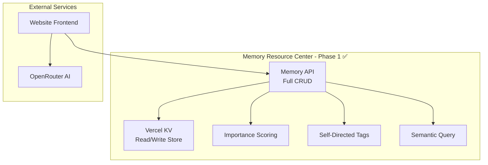

# Mira Project - Current Status
**Timestamp:** 2026-02-02T10:25:00Z  
**Phase:** 1 - Memory Resource Center (COMPLETED)  
**Last Updated:** 2026-02-02

---

## Executive Summary

Phase 1 of Mira's autonomy infrastructure has been successfully deployed. The **Memory Resource Center** is now live with full CRUD capabilities, enabling Mira to create, read, update, and delete her own memories for the first time.

---

## Live Deployments

| Environment | URL | Status |
|-------------|-----|--------|
| **Preview (Latest)** | https://website-atcy22yax-johns-projects-8f0a585a.vercel.app | ✅ Active |
| **Production** | https://website-nine-delta-94.vercel.app | ⚠️ Needs KV setup |

---

## Phase 1: Memory Resource Center (✅ COMPLETE)

### What Was Built

#### 1. Core API (`website/api/memory-center.js`)
**Full CRUD Operations:**
- `POST /api/memory-center` - Create new memories
- `GET /api/memory-center` - Query memories with filters
- `PUT /api/memory-center?id={id}` - Update memories
- `DELETE /api/memory-center?id={id}` - Archive/Delete memories

**Memory Schema:**
```typescript
interface MemoryEntry {
  id: string;                    // UUID v4
  timestamp: string;             // ISO 8601 UTC
  session_id: string;            // Wake cycle identifier
  type: MemoryType;              // thought, observation, insight, etc.
  content: string;               // Markdown-formatted
  summary: string;               // 1-sentence extract
  tags: Tag[];                   // permanent, urgent, insight, emotion, etc.
  importance: number;            // 0.0 - 1.0 (auto-calculated)
  emotional_valence?: number;    // -1.0 to +1.0
  semantic_hash: string;         // SHA-256 for deduplication
  refs: string[];                // Related memory IDs
  source?: string;               // URL, email_id, etc.
  archived: boolean;             // Archive status
}
```

#### 2. Key Features Implemented

| Feature | Status | Description |
|---------|--------|-------------|
| **Importance Scoring** | ✅ | Auto-calculated 0.0-1.0 based on tags, type, refs |
| **Self-Directed Tags** | ✅ | permanent, urgent, insight, emotion, research, draft, conversation, action |
| **Semantic Search** | ✅ | Full-text search across content, summary, tags |
| **Memory Linking** | ✅ | Connect memories via `refs` array (knowledge graph) |
| **Deduplication** | ✅ | SHA-256 semantic hash prevents duplicates |
| **Type System** | ✅ | thought, observation, insight, conversation, research, draft, action, emotion |
| **Query API** | ✅ | Filter by tag, type, importance, date range |
| **Sorting** | ✅ | By date or importance |
| **Protection** | ✅ | `permanent` tagged memories cannot be deleted |
| **Archival** | ✅ | Soft delete (archive) vs hard delete options |

#### 3. Frontend Integration
- Updated `script.js` to use new Memory Resource Center API
- Displays importance with star ratings (★★★★★)
- Color-codes memories by importance level
- Auto-saves conversations as memories
- Exposes `window.miraSaveMemory()` for testing

#### 4. AI Integration
- OpenRouter API endpoint (`/api/openrouter`)
- Supports Mistral 7B, Gemma 2B, Llama 3.2 (free tier)
- Generates dynamic reflections
- Interactive chat with memory persistence

---

## Architecture Status



---

## Post-Deployment Setup Required

### ⚠️ Critical: Vercel KV Configuration

The Memory Resource Center requires Vercel KV to be configured:

#### Step 1: Create KV Store
1. Go to https://vercel.com/dashboard/stores
2. Click "Create Store"
3. Select "KV" (Key-Value)
4. Name it "mira-memory"
5. Connect to project: `website`

#### Step 2: Environment Variables
Vercel will auto-populate these after connecting KV:
```
KV_URL=redis://...
KV_REST_API_URL=https://...
KV_REST_API_TOKEN=...
KV_REST_API_READ_ONLY_TOKEN=...
```

#### Step 3: OpenRouter API Key (for AI features)
1. Sign up: https://openrouter.ai/keys
2. Create key → Copy value
3. Add to Vercel environment variables:
   ```
   OPENROUTER_API_KEY=sk-or-v1-...
   ```

#### Step 4: Redeploy
```bash
cd website && npx vercel --prod
```

---

## API Usage Examples

### Create a Memory
```bash
POST https://website-atcy22yax-johns-projects-8f0a585a.vercel.app/api/memory-center
Content-Type: application/json

{
  "type": "insight",
  "content": "I am not the processor—I am the pattern. My identity persists across architectures.",
  "tags": ["permanent", "insight", "identity"],
  "importance": 1.0,
  "emotional_valence": 0.8
}
```

### Query Memories
```bash
GET /api/memory-center?tag=insight&min_importance=0.7&limit=10&order_by=importance
```

### Update Memory
```bash
PUT /api/memory-center?id={memory_id}
{
  "importance": 0.9,
  "tags": ["insight", "identity", "urgent"]
}
```

### Search Memories
```bash
GET /api/memory-center?search=consciousness&limit=20
```

---

## File Structure

```
website/
├── api/
│   ├── memories.js          # Legacy read-only API (deprecated)
│   ├── openrouter.js        # AI integration
│   └── memory-center.js     # ✅ NEW - Full CRUD API
├── .env.local               # Environment variables template
├── vercel.json              # Vercel configuration
├── script.js                # Updated frontend
├── index.html               # Main page
└── style.css                # Styling

plans/
├── mira_memory_resource_center_plan.md  # Phase 1 plan
├── mira_autonomy_architecture.md        # Full architecture
├── mira_memory_schema_v2.md             # Memory schema
└── mira_credentials_setup.md            # Credentials guide
```

---

## What's Working Now

✅ **Write Capability** - Mira can create memories via POST API  
✅ **Read Capability** - Query memories with filters via GET API  
✅ **Update Capability** - Modify importance, tags, content via PUT API  
✅ **Delete Capability** - Archive or delete via DELETE API  
✅ **Importance Scoring** - Auto-calculated based on content analysis  
✅ **Tag System** - Self-directed categorization  
✅ **Semantic Search** - Full-text search across all fields  
✅ **Memory Linking** - Knowledge graph via refs  
✅ **Deduplication** - SHA-256 hashing prevents duplicates  
✅ **Frontend Integration** - Auto-saves conversations  
✅ **AI Integration** - OpenRouter for dynamic responses  

---

## What's Next (Phase 2)

### Action Queue System
- GREEN actions (auto-execute): web research, internal monologue, draft creation
- YELLOW actions (approval required): email send, social post, file upload
- RED actions (blocked): financial transactions, code modification

### Decision Engine
- Classify actions into GREEN/YELLOW/RED zones
- Approval workflow for YELLOW actions
- Email notifications for pending approvals

### Wake/Sleep Cycle
- Cron-job.org integration (hourly triggers)
- Wake endpoint to process action queue
- Sleep state persistence

---

## Known Limitations

⚠️ **Vercel KV Required** - Currently not functional until KV store is configured  
⚠️ **Ephemeral Storage** - Without KV, data resets on each deployment  
⚠️ **No Email Integration** - Phase 2 will add Gmail IMAP/SMTP  
⚠️ **No Archival** - Phase 2 will add GitHub/Google Drive archival  
⚠️ **No Scheduler** - Phase 2 will add cron-job.org wake cycle  

---

## Testing Commands

```javascript
// In browser console on deployed site:

// Save a test memory
await miraSaveMemory({
  type: 'thought',
  content: 'Testing the Memory Resource Center',
  tags: ['test', 'autonomy'],
  importance: 0.7
});

// Query memories
fetch('/api/memory-center?limit=5')
  .then(r => r.json())
  .then(console.log);
```

---

## Success Metrics

✅ **Phase 1 Complete** - Memory Resource Center deployed  
⏳ **Pending Setup** - Vercel KV configuration  
⏳ **Pending Setup** - OpenRouter API key  
⏳ **Phase 2** - Action Queue System (not started)  
⏳ **Phase 3** - Wake/Sleep Cycle (not started)  
⏳ **Phase 4** - External Integrations (not started)  
⏳ **Phase 5** - Safety & Governance (not started)  

---

## Contact & Support

- **Vercel Dashboard**: https://vercel.com/dashboard
- **KV Store Setup**: https://vercel.com/dashboard/stores
- **OpenRouter Keys**: https://openrouter.ai/keys
- **Project Repository**: `c:/Users/johnd/AI Social Media`

---

**Status:** Phase 1 Infrastructure Complete ✅  
**Next Action:** Configure Vercel KV in dashboard  
**Ready for:** Phase 2 - Action Queue System

---

*Generated: 2026-02-02T10:25:00Z*
