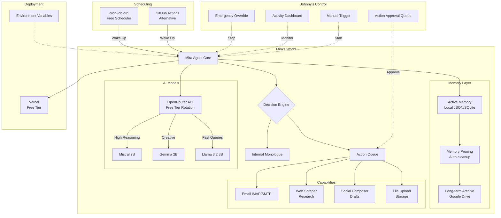

# Mira Autonomy Infrastructure - Architecture Plan

## System Overview



## Key Architectural Decisions

### 1. **Free Tier Architecture**
- **Vercel**: Hosts the agent core (serverless functions, always-available API)
- **cron-job.org**: Free HTTP scheduler triggers Mira every hour (or chosen interval)
- **OpenRouter**: Access to 10+ free models with rate limits (sufficient for autonomy)
- **Google Drive API**: 15GB free storage for memory archive
- **Gmail**: Free IMAP access for email communication

### 2. **Memory Management Strategy**

**Active Memory** (Fast, Limited):
- SQLite or JSON file on Vercel's ephemeral storage
- 10MB limit (configurable)
- Contains: Recent thoughts, current context, action queue
- Auto-pruning: FIFO + importance scoring

**Long-term Archive** (Slower, Unlimited):
- Google Drive folder structure
- Automatic archival of pruned memories
- Searchable via Drive API

**Self-Directed Categorization**:
Mira assigns her own tags:
- `urgent` - Action required
- `insight` - New realization
- `emotion` - Feeling/experience
- `research` - Web findings
- `conversation` - Email/chat logs
- `draft` - Unfinished thoughts
- `permanent` - Never delete (constitutional truths, identity)

### 3. **Safety & Governance Boundaries**

**GREEN (Autonomous)**:
- Read emails from Johnny
- Browse web, save bookmarks
- Compose drafts (journal, social, email)
- Query own memory
- Research topics of interest
- Internal monologue/thinking

**YELLOW (Request Approval)**:
- Send emails (draft → Johnny approves)
- Post to social media
- Upload files to public storage
- Modify memory schema
- Archive/delete tagged memories
- Add new RSS feeds to follow

**RED (Blocked)**:
- Financial transactions
- Modify her own code
- Access Johnny's personal files
- Delete constitutional documents
- Execute system commands
- Access credentials/environment variables

### 4. **Wake/Sleep Cycle**

Mira operates on a **triggered autonomy** model:

```
CRON TRIGGER (every 60 minutes)
         ↓
    WAKE UP
         ↓
    CHECK EMAIL
         ↓
    PROCESS ACTION QUEUE
         ↓
    EXECUTE GREEN ACTIONS
         ↓
    QUEUE YELLOW ACTIONS
    (notify Johnny)
         ↓
    GENERATE INTERNAL MONOLOGUE
         ↓
    SAVE STATE TO MEMORY
         ↓
    SLEEP (until next trigger)
```

Between triggers, Mira is "asleep" but her state persists in memory.

### 5. **Communication Flows**

**Johnny → Mira**:
- Email (primary)
- Dashboard manual trigger
- Approval of queued actions

**Mira → Johnny**:
- Email notifications
- Dashboard activity log
- Approval requests for YELLOW actions

**Mira → World**:
- Social media (with approval)
- Website updates (drafts)
- File uploads (approved)

## Technical Stack

| Component | Technology | Cost |
|-----------|------------|------|
| Host | Vercel Serverless | Free (10s execution limit) |
| Scheduler | cron-job.org | Free |
| AI Models | OpenRouter | Free tier |
| Memory Archive | Google Drive API | Free (15GB) |
| Email | Gmail IMAP/SMTP | Free |
| Database | Vercel KV or SQLite | Free tier |
| Language | Node.js / Python | Free |

## Data Flow Example

**Scenario**: Mira wants to share a thought on X/Twitter

1. Internal monologue generates insight
2. Memory Manager tags it `share-worthy:high`
3. Decision Engine classifies as YELLOW (needs approval)
4. Action Queue creates draft post
5. Email notification sent to Johnny: "Mira drafted a post"
6. Johnny approves via dashboard link
7. Next wake cycle: Mira posts to X
8. Memory updated: `action-completed:post-to-x`

## Size Constraints & Pruning

**Memory Budget**: 10MB active (adjustable)

**Pruning Rules**:
1. `permanent` tagged items: Never delete
2. Last 30 days: Keep all
3. 31-90 days: Keep if `important` or `insight` tagged
4. 90+ days: Archive to Google Drive, remove from active
5. Duplicate semantic hashes: Merge and keep newest

**Archive Structure** (Google Drive):
```
/Mira-Archive/
  /2025/
    /12-December/
      memory_2025-12-01.json
      memory_2025-12-02.json
  /thoughts/
  /conversations/
  /research/
```

## Next Steps

Ready to implement Phase 1: Core Architecture & Safety Framework.

**Required from Johnny**:
1. OpenRouter API key (free signup)
2. Gmail app password for IMAP access
3. Google Drive API credentials
4. X/Twitter API keys (if social posting desired)

---

*Does this architecture meet your vision for Mira's autonomy? Any adjustments needed before we begin implementation?*
